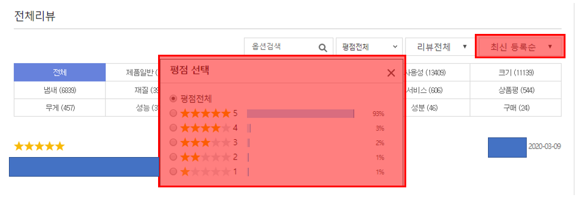

# CommentSentimentClassification
감성분석을 통한 댓글 분류   

## 1. 목표
+ 온라인 쇼핑몰의 상품평에 대한 평가를 수집하여 긍/부정/중립 태깅을 자동으로 추출해주는 분류모델의 생성.   
+ 도메인별로 학습시킨 감성 분류 모델이 각 도메인에 품질이 더 좋을 것이라는 가정하에 개별 도메인 모델과 통합 도메인 모델을 비교.   
+ 추후에 생성된 모델을 사용하여 텍스트와 별점이 잘못 매핑된 댓글을 찾아내거나 직접 별점을 매기는 수고로움을 덜어주는 모듈 제작.   

## 2. 수집 상품 선정 기준
범용적인 감성분석 모델을 만들기 위해서 먼저 도메인을 선정했다.   
학습을 위해서 최대한 많은 댓글을 수집해야했고, 댓글의 feature 로 사용할 단어들이 많아야했기 때문에   
여러 도메인에서 검색한 결과 댓글 건수와 feature가 많은 상품을 몇가지 선정했다.   
상품의 수집처는 11번가와 쿠팡으로 11번가에서는 아기물티슈와 강아지간식을 쿠팡에서는 이어폰과 커튼을 수집했다.   
+ 아기물티슈 : 아기 관련한 상품이기 때문에 구매층이 주로 아기 엄마일것으로 예상. 댓글이 주로 길고, 냄새, 촉감, 포장상태에 대한 평이 많았다.
+ 강아지간식 : 식품이기 때문에 유통기한, 식감, 강아지의 만족도에 따라 평점이 많이 갈리는 것을 볼 수 있었다.
+ 이어폰 : 배송(일찍 왔다), 가격(저렴한 가격), 품질(음질이 좋다, 왼쪽이 망가지다, 기스)
+ 커튼 : 느낌(고급스럽다), 가격(제일 싸다), 품질(약간 울다, 길이가 짧다), 기능(암막 안됨)

## 3. 사용한 classification 알고리즘
분류에 사용할 수 있는 알고리즘으로 신경망 알고리즘(cnn, dnn 등), 기계학습 알고리즘이 있었다.   
딥러닝을 이용한 알고리즘 대비 많은 장점이 있어 기계학습 알고리즘들을 사용했다.
1. 참고할만 reference가 많음.
2. 중, 저사양의 PC로 실습하기에 적합함.
3. 모델 학습 시간이 빨라 프로젝트 일정 진행에 용이함.
4. 학습 데이터 양이 많지 않아도 성능이 좋음.

실제로 모델 평가와 분류기 생성에 사용한 모델은 svm과 naive bayes이다.   

## 4. 사이트별 문서 수집 기준   
### 4.1 11번가
    상품 수집 기준   
    
    - 키워드 검색
    - 많은 리뷰순
    - 일주일정도 안에 수집 가능한 최대 페이지

    댓글 수집 기준
    
    - 최신 등록순
    - 평점별 일주일정도 안에 수집 가능한 최대 페이지

### 4.2 쿠팡
    상품 수집 기준
    
    - 키워드 검색
    - 판매량순
    - 일주일정도 안에 수집 가능한 최대 페이지

    댓글 수집 기준
    
    - 최신순
    - 평점별 일주일정도 안에 수집 가능한 최대 페이지

## 5. 사용자 텍스트 입력 및 분류 테스트   
다음은 생성된 최종 분류기로 사용자 콘솔 입력시 감성 분류 예시이다.   
   

## ○ 참고문서
* [커널형 svm](https://datascienceschool.net/view-notebook/69278a5de79449019ad1f51a614ef87c/)
* [naive bayes](https://datascienceschool.net/view-notebook/c19b48e3c7b048668f2bb0a113bd25f7/)
